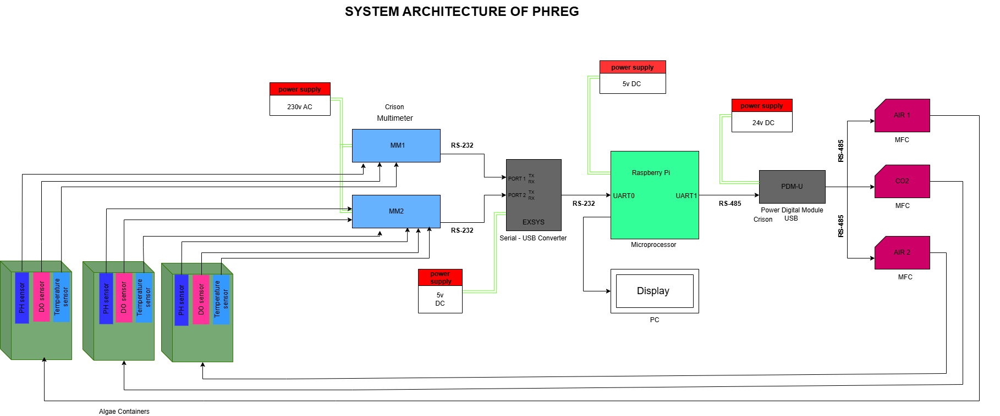

# PHREG – Automated pH Regulation System

## Overview
This project implements an embedded control system for automated pH regulation in CO₂-aerated microalgae cultures.

The system retrofits legacy Crison transmitters and integrates Mass Flow Controllers (MFC) to maintain stable pH using feedback control.

---

## Key Features
- Real-time pH monitoring via Crison MM44 transmitters
- CO₂ flow regulation using Mass Flow Controllers (MFC)
- PID-based control algorithm with safety constraints
- Modbus RTU communication (RS232)
- Data logging and dashboard interface
- Multi-reactor support

---

## System Architecture


---

## Project Structure
PHREG-pH-Control-System/
│
├── controller/
│ ├── main.py # Entry point
│ ├── controller.py # Control loop logic
│ ├── pid.py # PID controller implementation
│ ├── mfc.py # Mass Flow Controller communication
│ ├── mm44.py # Sensor data parsing (Crison MM44)
│ ├── dashboard_io.py # Dashboard interface
│ ├── logging_utils.py # Data logging utilities
│ ├── config.py # System configuration
│ └── utils.py # Helper functions
│
├── docs/
│ └── architecture.png # System architecture diagram
│
├── requirements.txt # Python dependencies
├── README.md # Project documentation
└── .gitignore

---

## How to Run

```markdown
## How to Run

```bash
pip install -r requirements.txt
python -m controller.main

## Results
```markdown
## Results

- Stable pH regulation achieved
- Real-time monitoring and logging implemented
- Modular embedded software architecture

## Technologies Used
- Python
- Modbus RTU (RS232)
- Raspberry Pi
- PID Control

## Authors
- **Shyamal Hirapara** – Embedded control system, communication, and integration  
- **Maulik** – Dashboard, data logging, and visualization
